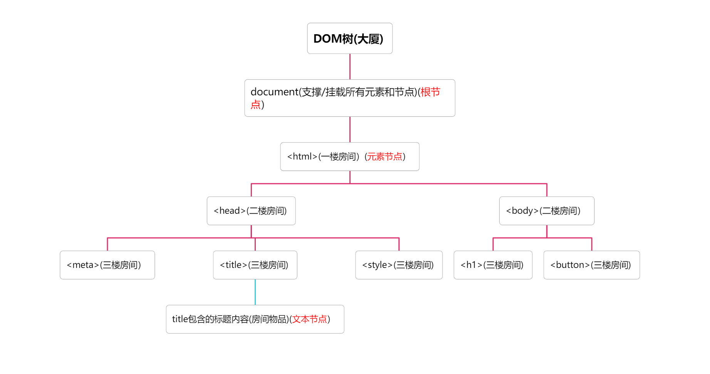
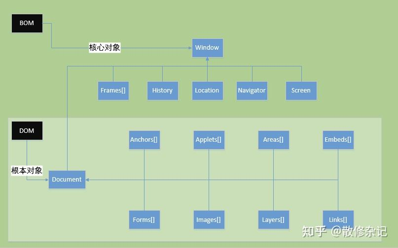
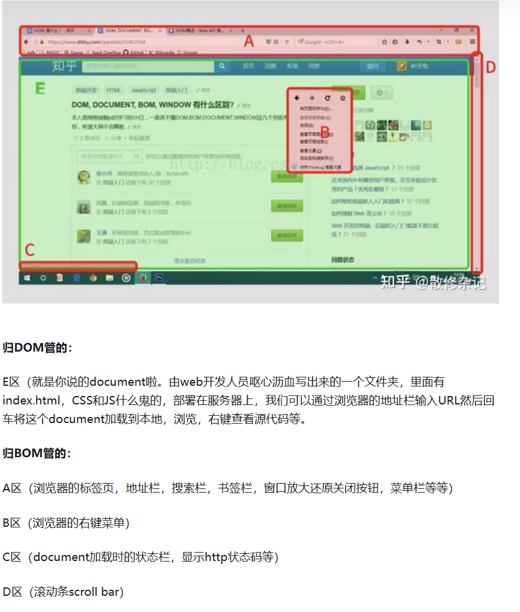

# 1.大方向

## 前端开发

# 2.相关知识

## 已掌握

前端大部分HTML基础以及部分CSS和JS基础、可以做出简单的静态页面、实现过SQL Server与QT的基础连接

## 未掌握

部分CSS和JS基础、组件的更多样化、动态页面的实现等

# 2.细化路线

详细文档参考[1]<font color='blue'> 前端学习路线</font>

详细前端项目练习参考[2]<font color='blue'> 50个前端小项目</font>

## HTML——⭐

- [x] 常用标签

- [x] 块级元素和行级元素

- [x] HTML标签样式

- [x] 表单

- [x] SEO搜索引擎优化

  详细参考[3]<font color=blue>SEO</font>

## CSS——⭐⭐

- [x] 引用样式
- [x] CSS选择器
- [x] 基础样式语法
- [x] display属性
- [x] 常用布局
  - [x] float类型
  - [x] 盒模型
  - [x] position定位
  - [x] flex
  - [x] gridlayout
- [x] 伪类
- [x] 响应式设计

详细学习笔记参考[3] <font color='blue'>基础语言学习</font>

## JS——⭐⭐⭐⭐

详细参考[4]<font color='blue'> 菜鸟教程</font>

详细参考[5]<font color='blue'> 后盾人</font>

### 基本

- [x] 基本用法

- [x] 编译器

- [x] JS与Chrome

- [x] 输出

- [x] 语法

- [x] 语句

- [x] 注释

- [x] 变量

- [x] 数据类型

- [x] 对象

- [x] 函数

  - 函数提升：函数可以在声明之前调用

  - 函数自调用/自执行：通过将函数的声明和调用合并在一起完成封装提升程序可维护度

    ```js
    //两种格式
    (function(){...})()//前面的()是函数声明，后面()则是执行函数
    (function(){...}())//外面的()是函数声明，里面()则是执行函数
    //传参范例
    (function(a,b){return a*b})(1,2)
    (function(a,b){return a*b}(1,2))  
    //这种自调用函数一般都不会再外面使用所以几乎匿名函数，但是如果要在外面调用的话可以选择在function后面加上函数名字，然后就可以实现外部调用了。          
    ```

  - 闭包：将函数内部和函数外部连接起来的桥梁

    - 定义：是指一个函数可以记住其外部变量并可以访问这些变量

    - ==问题：为什么JS中所有函数都是闭包的==：JS中的函数会自动通过隐藏的[[Environment]]属性(词法环境对象)记住创建他们的位置：当前函数的词法环境对象 ==>外层函数的词法环境对象 ==>全局的词法环境对象，所以它们都可以访问外部变量

    详细参考[6]<font color="blue">JS中所有函数都是闭包的？</font>

- [x] 作用域

- [x] 事件：可以被JS侦测到的行为，是一种“触发-响应”机制

  - 三要素
  - 事件源：触发事件的元素
  - 事件类型：事件的触发方式（例如鼠标点击或者键盘点击）
  - 事件处理程序：事件触发之后要执行的代码（函数形式）

- [x] 字符串

- [x] 字符串模板

- [x] 运算符

- [x] 比较

  - 比较运算符：\==、\=\==、!=、!==、>、<、>=、<=

  - 逻辑运算符：&&、||、！

  - 条件运算符：？a:b

- [x] 条件语句

  - if…else

- [x] switch语句

  ```js
  switch(a){
  	case 0:...
  	break;
  	...
  	default:...
  }
  ```

- [x] for循环

  - 普通for循环

  ```js
  for(var i=0;i<n;i++){}
  ```

  - for/in循环:遍历对象属性:具体见show.html

- [x] while循环

  ```js
  while(条件){执行语句}
  ```

  ```js
  do{执行语句}while(条件)
  ```

- [x] break 和 continue语句

  - break:跳出此循环

  - continue:跳过此段代码，但是继续此循环

  - 加标签的break和continue:具体见show.html

- [x] typeof/null/undefined

- [x] 类型转换

  - 其他->字符串：String(内容)|对象.toString();

  - 字符串->数字

  ```js
  Number("3.14")    // 返回 3.14
  Number(" ")       // 返回 0
  Number("")        // 返回 0
  Number("99 88")   // 返回 NaN,无意义
  ```

  ```js
  var y = "5";
  var x = + y;//利用一元运算符+转化
  ```

- [x] 正则表达式

- [x] 错误:try\throw\catch\finally

- [x] 调试

- [x] 变量提升:执行JS函数时没有赋值的变量声明会被提到最前面，赋值的变量声明不会提前。

- [x] 严格模式：“use strict”

  - 不允许使用未声明的变量
  - 不允许删除(delete)变量或者对象
  - 不允许删除函数
  - 不允许变量重名
  - 不允许使用转义字符
  - 变量名不能使用“eval”或者“arguments”
  - 保留关键字不能用作变量名字或者函数名字

- [x] 使用误区

  - if里面的判断语句是两个=；
  - 比较两个变量的时候要保证变量类型一致；
  - 使用“+”符号的时候注意区分数字相加和字符串连接；
  - 浮点型数据计算时会用64位储存，所以最好先转化成整型再进行计算；
  - 输出字符串的时候不要直接回车换行，要使用换行符号“\n”

- [x] 表单

- [x] 表单验证

- [x] 保留关键字

- [x] this

- [x] let 和const

- [x] JSON：javasciipt object notation,一种轻量级数据交换格式

- [x] void:无返回值函数

- [x] 代码规范

  - 命名变量：全局/常量全大写、其余camelCase(驼峰法)
  - 通常运算符前后添加空格
  - 代码缩进用四个空格，不推荐tap(不同编译器对tap解析不同)

### 类

- [x] 类
- [x] 类的继承
- [x] 静态方法

### DOM和BOM

- ####  DOM：Document Object Model(文档对象模型)

==DOM到底是什么:==一种网络文档的编程接口，方便编写程序去修改文档的结构、风格和内容，编程语言就可以和页面进行交互；

==抽象—>形象==：大厦整体



对大厦的管理（操作DOM—api）

- 查找元素（寻找房间）：根据CSS选择器查找/根据queryDelector找到第一个匹配的元素/querySelectorAll找到所有匹配的元素=根据房间号或者楼层对应位置找房间；
- 修改房间（改造房间）：改变元素内容样式或者属性:innerHTML/textContent/style等；
- 添加和删除元素（新建一个房间或者拆掉一个房间）：添加或者删除DOM树中的元素
  - 例如：document.createElement('div')可以创建一个新的<div>元素
  - 使用 parentElement.removeChild(childElement)可以删除一个元素。

外来访客/内部和大厦之间的互动（事件处理/监听—api）

- 例如：着火触发烟雾报警器/有人来探亲—按门铃
- 使用 button.addEventListener('click', function() { /* 处理点击事件 */ }) 可以为按钮添加一个点击事件监听器，当用户点击按钮时，就会执行相应的处理函数。

- [x] HTML DOM API:由一系列接口组成，定义了HTML中的每一个元素的功能以及他们所依赖的任何支持类型和接口

  - 功能
    - 通过DOM访问和控制HTML元素
    - 访问和操作表单数据
    - 在页面上拖放内容
    - 访问浏览器导航历史记录
    - 支持和关联其他API的接口
    
  - 几种常见接口

    详细参考[7]<font color="blue">HTML DOM API</font>
    
    ==问题==：Web组件的封装冲突
    
    ==答==：内部和外部冲突的时候(全局样式)，封装会保护我们自定义的元素不被影响；那如果我就想要外部CSS样式作用到我的封装自定义元素咋办呢？参考我的笔记中JS相关模块代码实例。

- [x] DOM html和css

- [x] DOM事件

- [x] DOM EventListener

==问题：==如果嵌套点击事件发生，那么触发顺序是什么呢

==答==：根据需求设置冒泡(false,从内到外)或者捕获(true,从外到内)，参考我的JS相关模块代码。

- [x] DOM 元素

- [x] HTML Collection 对象

- [x] NodeList对象

- [x] getElementsByTagName和querySelectorAll的区别

  - 返回值类型的区别
    - getElementsByTagName返回一个HTMLCollection对象，且相同对象的长度也会自动更新
    - querySelectorAll返回一个NodeList对象，但是相同对象的长度不会自动更新
  - 选择器的灵活性
    - getElementsByTagName只能通过标签名字来选取元素(只能选取DOM中的元素节点，collection是元素节点的集合)
    - querySelectorAll可以选取DOM树中的所有节点(nodelist是文档节点的集合)

- #### BOM

  

  详细参考[8]<font color="blue">DOM和BOM是什么，有什么作用?</font>

- #### 两者联系

  - 作用范围区别：DOM是面对HTML 文档操作，但是BOM是面对浏览器操作

  - 关系：BOM包含了DOM，主要操控一个网页再浏览器中进行的一些操作，比如页面的跳转前进后退等

    

### 接口请求

- [x] Ajax（异步JavaScript和XML）

- [x] Fetch

### 更多前端语言和标准

了解更多前端的语言及标准——TypeScript和ES6

#### TypeScript

##### 和JS的区别：支持JS中的所有语法，并且在此基础上面扩展了更多的面向对象编程(OOP)的功能

##### TS核心概念

- 基本语法——变量或者属性名字：数据类型(例如：const name:string='zrc';)

- ==为什么要这样“多此一举”呢？==

  ==答：==JS中没有详细的数据变量类型，var可以涵盖很多，灵活性很强，但是当项目规模宏大的时候变量类型也会随之变多，模块之间的交互关系就会变得复杂，这时候这种灵活性就可能会造成很多连锁麻烦

##### TS环境配置

- 首先需要安装Node.js，在包管理nmp中执行安装TypeScript命令
- 测试文件：在vscode里面创建一个.ts文件并且打开对应终端之后输入执行命令行tsc xxx.ts即可
- 测试结果：相同根目录里面出现一个js格式的文件xxx.js，打开之后发现是由刚刚那个xxx.ts变化得来的xxx.js文件，内容是一样的，只是格式不一样

详细TypeScript参考[9] <font color='blue'>TypeScript</font>

#### ES6( ECMAScript 2015)

##### 和JS的关系：是JS语言的下一个标准或者说是语言规范

##### 部分新特性：

==目前我使用的VScode已经支持ES6标准==

- ES6中的let命令，声明变量，用法和var差不多，但是let是为JavaScript新增了块级作用域
  而在ES5中是没有块级作用域的 

- ES6中变量的解构赋值，比如：var [a,b,c] = [0,1,2]，而ES5中是需要一个一个的赋值的

- ES6中不再像ES5一样使用原型链实现继承，而是引入Class这个概念，听起来和Java中的面向对象编程的语法有些像，但是二者是不一样的。

- ES6中的函数定义也不再使用关键字function，而是利用了=>来进行定义；

  ```js
  // ES5
  var add = function(a, b) {
      return a + b;
  };
  
  // ES6
  var add = (a, b) => a + b;
  ```

- ES6中可以设置默认函数参数，如function A（x,y=9）{};

##### 为什么要单独的强调ES6呢

- 了解到目前国际最新的标准已经不是ES6了，但是我们还是单拎出来这一标准由于他的里程碑式作用，它新引入了很多经常使用的新特性，就像上面我搜到的块级作用域、箭头函数以及类和继承机制等，从此让我们的JS表达能力和开发效率大大提升，代码编写更加简洁、高效并且也容易维护

详细ES6参考[10] <font color='blue'>ECMAScript 6 入门</font>

### 异步编程

> 异步：主线程进行的同时，存在多个子线程也在进行

>  同步：只有一个线程，多个任务是排队逐个完成的

- 回调函数：在启动一个异步任务的时候就告诉这个回调函数，在你完成了这个任务之后要做些什么，这样主线程就不需要关注异步任务；

### Promise

> ES6提供的类，为了更加优雅的书写复杂的异步任务

- 格式

  ```js
  new Promise(function(resolve,reject){要做的事情});
  ```

- 需要使用这个的情况：见代码实例

#### promise的构造函数

> 用于创建Promise对象的内置构造函数

- 起始函数

  > promise的内置构造函数会接受一个函数作为参数，这个被接受的函数是和构造函数同步的并且会立即被执行，称之为起始函数

  - 起始函数包含两个参数：reslove和和 reject，分别表示 Promise 成功并传递成功结果和失败的状态并传递失败的原因

- Promise对象

  > 是由Promise构造函数返回的对象

  - 几种方法
    - then：用于处理 Promise 成功状态的回调函数。
    - catch：用于处理 Promise 失败状态的回调函数。
    - finally：无论 Promise 是成功还是失败，都会执行的回调函数。

### 事件机制

- [x] 事件流

  >  通常事件触发产生三个阶段：事件捕获阶段->处于目标阶段->事件冒泡阶段
  >
  > >  当事件触发的时候，先从DOM树顶层(document)开始往下逐层==捕获==目标事件源元素,之后==处于目标阶段==，之后该目标事件会随着DOM树的层级路径由字节点向父节点进行层层传递直至到达根节点

  - 从三个阶段的分析可以看出，捕获阶段和冒泡阶段都是会经历目标事件的传递，所以我们平时==绑定的事件==就可以绑定在事件捕获阶段或者冒泡阶段

  - 常用事件绑定类型

    ```js
    //1)DOM0级
    document.onclick=function(){}//绑定
    document.onclick=null//移除
    //2)DOM2级
    document.addEventListener(function(){},false)//绑定，冒泡
    document.removeEventListener(function(){},false)//移除，冒泡
    ```

  - 事件绑定方式

    ```js
    1)作为属性，写在HTML元素上面
    2)document.onclick=function(){}
    3)document.addEventListener(function(){},false)//冒泡
    ```

- [x] 绑定元素和目标元素

  - 绑定元素：把事件处理函数绑定在元素上面(动词性名词，针对后台)
  - 目标元素：用户操作界面，用户触发的元素(名词性名词，针对界面)

  ==个人理解:==角度不同吧；绑定元素是以绑定函数的角度看，它和它绑定的后台函数是并存的，绑定元素是寄存函数的载体，函数是他的灵魂；而目标元素是发自用户的，用户点击一个元素之后，后台会根据这个元素来一次对比查找DOM树中的它并执行相应的行为

- [x] 事件的执行顺序

  - 所有绑定方式都遵循——对于同一个绑定元素，都是遵循先绑定的先执行的原则
  - 如果是以普通的onclick方式绑定的，对于同一个元素来说，如果有多个onclick绑定函数，那么就只会执行一次，并且是最后一个onclick函数；但是如果是以addEventListener方式绑定的话那么同一个元素被绑定不管多少次都会按顺序执行
  - 如果直接在DOM中使用onclick，那么onclick的绑定是要早于addEventListener的

- [x] 事件对象event

  > event.target：指的是==触发事件==的那个节点，即事件最初发生的节点(最里层的节点)
  >
  > event.currentTarget：指的是正在执行的==监听函数==所绑定的那个节点。
  >
  > event.path：指的是事件==冒泡==的顺序。
  >
  > event.timeStamp：指的是从事件绑定完成到此次事件触发的时间，单位是毫秒。
  >
  > event.type：事件的类型，比如click，input
  >
  > event.isTrusted：表示事件是否是真实用户触发，true表示是真实用户触发，false表示脚本触发。
  >
  > event.preventDefault()：取消事件的默认行为，比如 a标签 默认跳转到一个新网址，如果阻止默认行为，就不会跳转。
  >
  > event.stopPropagation()：当有event对象时，阻止事件冒泡。
  >
  > window.event.cancelBubble = true：当没有event对象时，阻止事件冒泡（一般用在IE浏览器）。
  >
  > event.stopImmediatePropagation()：阻止同一个事件的其他监听函数被调用。比如对同一个元素绑定了两个click事件，如果在第一个click事件写了event.stopImmediatePropagation()，那么它的其他点击事件就都不会被触发。

- [x] 事件委托(事件代理)

  > 存在目的：一种DOM模式，为了减少绑定元素个数和事件处理函数产生

  > 方式：借用事件冒泡或者事件捕获机制

  > 适用场景：当我们存在有很多以类似方式处理的元素的时候，那么就不必为每一个元素都分配一个事件处理程序——而是将单个处理程序放在它们的共同祖先上

详细参考[11] <font color='blue'>深入理解js事件机制</font>

### 性能优化

> 目的：需要对频繁触发事件进行控制，提升性能和用户体验

- [x] 防抖

- [x] 节流

- [x] 二者区别

  > 触发方式上：防抖是事件停止触发之后设置缓冲时间之后执行函数，但是节流是在一定时间间隔之内只会执行一次函数

  > 应用场景上：防抖适用于在用户停止输入或者操作之后才进行处理的场景，比如表单验证；节流适用于在一段时间内只执行一次的场景，比如按钮防止多次点击

详细参考[12] <font color='blue'>防抖节流区别</font>

## 网络基础——⭐⭐

- [x] Web机制

  > 互联网和Web的区分：互联网允许我们把电脑连接起来，其中有些特殊的电脑可以发送一些浏览器可以理解的信息，他们被称为Web服务器；总的来说就是互联网是基础设施而Web是一种服务

- 互联网是怎么工作的

  >  一片区域的电脑连接->把不同区域连接起来成为网络->把信息通过这个巨大的网发送出去

  - 概述：互联网是Web的支柱，它是把电脑互相连接起来的一个巨大网络
  - 有线方式实现电脑的连接：每个电脑需要8个插头，总共需要45根网线，这是非常麻烦的，所以网络上每台电脑需要链接到一个叫做路由器的特殊小电脑，假设我要把信息从A发送到B，==中间人就是由路由器==；这样只需要==把十台电脑都连接到路由器上面就可以实现信息互传==，这时候只需要10根网线。
  - 不同小网络的连接——电缆：调制解调器可以把网络信息变成电话设施可以处理的信息(反之亦然)
  - 发送信息：把网络连接到互联网服务提供商(ISP),它管理着和一些特殊路由器，这些特殊路由器是用来连接其他的ISP的。我们要发送信息出去的时候，ISP就会捕获我们的信息，并且发送到相应的网络处
  - IP(网络协议)地址:网络要在他管理的众多电脑中找到你想要发送信息的那一台电脑就是要靠这个IP地址，这个地址是由四部分被点分隔的数字序列组成，比如：192.0.2.172，在浏览器中搜索不是靠这种IP地址，而是用一个叫做域名的可读名称来代替它，比如google.com就是谷歌IP的域名

- 网页、网站、网络服务器和搜索引擎的区别是什么

  - 网页：一份能够显示在Web浏览器上面的文档，常被叫做page，使用HTML语言编写的；==注意==浏览器不是只能显示HTML文档，比如PDF等，但是这里我们说的是网页，特指HTML文档
  - 网站：一个由许多网页组合在一起的集合，其中的网页常常以各种方式相互连接，通常称为站点
  - Web服务器：==一个==在互联网上托管网站的==计算机==，会有一些软件功能，用户尝试加载网页的时候，Web服务器就会将其托管的网页文件发送到用户的浏览器
  - 搜索引擎：帮助我们查找其他网页的网络服务

- Web是如何工作的：比如我打开一个浏览器输入网址并且按下回车，然后网站出现在我的浏览器中

  - 浏览器从储存资源的Web服务器中请求我想要访问的资源(发送请求)，这些请求以及产生的响应是通过HTTP的技术实现的，不同的请求方式(POST/GET)进行不同的操作
  - 如果请求成功，Web服务器会将包含所需资源的HTTP响应发送到我们的浏览器
  - 资源请求完成之后Web浏览器会按照要求解析和渲染他们之后呈现给用户

- 链接很重要，一种连接Web服务器中不同资源的方式

  > 链接的类型
  >
  > 内链：网站中的网页之间的链接，没有内部链接就没有网站(除非你的网站只有一页)
  >
  > 外链：我的网页到别的网页之间的链接，没有外部链接就没有Web
  >
  > 传入链接：别人的网页到我的网页的链接

  > 锚：一种连接你的网页中的不同段落的方式

- 什么是URL

  > 网络中唯一资源的地址，是浏览器用于检索以及发布的资源的关键机制之一

  > 形象化：我们要寄快递，快递地址是URL，我们想要使用的邮政服务是方案(http或者https)，地址所在城市或者城镇就是域名——www.example.com，快递编码就是端口(80)，我的快递要送到的地方就是路径，有些额外门牌号之的信息就是参数(用&分隔)，我的收件人就是锚点(用#分隔)

  - 权威：在方案后面，用://分隔，包括域名和端口，www.example.com：80

- 域名，从右到左阅读

  > 格式：label2.label1.TLD

  - TLD(顶级域名)

    > 顶级域名可以告诉用户域名所提供的服务的一般目的。最通用的顶级域名`.com`(商业公司)、`.org`(组织协会)、`.net`(网络服务)不需要 Web 服务满足特定的标准，但一些顶级域名则执行更严格的政策（因此它们的目的更加明确）。比如：

    - 地区的顶级域名，如 `.us`、`.fr` 或 `.sh`，可以要求必须提供给定语言的服务或者托管在指定国家——它们应该表示特定语言或国家的资源。
    - 包含 `.gov` 的顶级域名只能被政府部门使用。
    - `.edu` 顶级域名只能为教育或学术机构使用。

  - 标签(或者说是组成部分)

  - 咋获得域名呢？

    1. 去域名注册商的网站
    4. 注册商将会在域名正确注册后通知你，之后所有 DNS 服务器都会收到你的 DNS 信息
  
- web服务器

  - 静态服务器：这个服务器会把它托管的文件(成千上万个HTML文档)原封不动的传送到我的浏览器
  - 动态浏览器：由静态服务器和额外的软件组成——应用服务器和数据库(包含所有网站的内容，匹配成功填充HTML模版就行)，应用服务器会通过HTTP服务器把托管文件传送到我的浏览器之前会对这些托管文件进行更新

  详细参考：<font color="blue">[13]Web机制</font>

- [x] HTTP协议和TCP协议

- 开放系统网络分层
  - 应用层(+表示层+会话层):HTTP(网络请求协议)/SSH(远程登录协议)/FTP协议(文件传输协议)
  - 传输层:TCP/UDP协议(用户数据报协议)
  - 网络层：IP协议
  - 数据链路层：以太网
  - 物理层：线路、无线电、光纤

- HTTP协议：一个客户端(用户)和服务端(网站)之间请求和应答的标准

  - 目的：为了提供一种发布和接收HTML页面的方法

  - 具体用法：由客户端发起一个请求，建立一个到服务器指定端口的TCP连接，HTTP服务器则在那个端口监听客户端的请求，一旦受到请求，服务端回想客户端返回一个状态以及返回的内容(比如说请求的文件、错误消息等)

  - 消息结构

    - 客户端请求消息

      > 请求行：格式——方法+URL+HTTP版本——GET /index.html HTTP/1.1
      >
      > - 请求方法
      >
      >   - GET：向指定资源发出“显示”请求
      >
      >     > 应用场景：读取资料
      >
      >   - HEAD：向服务器发出指定资源的请求，只不过服务器将不传回资源的文本部分
      >
      >     > 好处以及应用场景：在不必传输全部内容的情况下就可以获得其中“关于该资源的原信息(或者说元数据)”
      >
      >   - POST：向指定资源提交数据，请求服务器处理(比如说提交表单或者上传文件)。其中数据被包含在请求文本中，这个请求可能会建立新的资源或者修改现有资源，或者二者都有
      >
      >   - PUT：向指定资源位置上传其最新内容。
      >
      >   - DELETE：请求服务器删除Request-URI所标识的资源
      >
      > 请求头：包含了客户端环境信息、请求体的大小（如果有）、客户端支持的压缩类型等
      >
      > - 常见请求头`Host`、`User-Agent`、`Accept`、`Accept-Encoding`、`Content-Length`
      >
      > 空行
      >
      > - 请求头和请求体之间的分隔符，表示请求头的结束。
      >
      > 请求体（可选）：
      >
      > - 在某些类型的HTTP请求（如 POST 和 PUT）中，请求体包含要发送给服务器的数据。

    - 服务器响应消息

      [http](http.png)

  - 状态码

    - [1xx消息](https://zh.wikipedia.org/wiki/HTTP状态码#1xx消息)——请求已被服务器接收，继续处理
    - [2xx成功](https://zh.wikipedia.org/wiki/HTTP状态码#2xx成功)——请求已成功被服务器接收、理解、并接受
    - [3xx重定向](https://zh.wikipedia.org/wiki/HTTP状态码#3xx重定向)——需要后续操作才能完成这一请求
    - [4xx请求错误](https://zh.wikipedia.org/wiki/HTTP状态码#4xx客户端错误)——请求含有词法错误或者无法被执行
    - [5xx服务器错误](https://zh.wikipedia.org/wiki/HTTP状态码#5xx服务器错误)——服务器在处理某个正确请求时发生错误

  - 和HTTPS的简单区别：HTTP传输未加密的数据，这意味着浏览器发送的信息可能会被第三方拦截和读取，这一过程并不理想，因此将其扩展为HTTPS，以便为通信再增加一层安全性

    详细区别参考<font color="blue">[14]HTTP/HTTPS</font>

  详细参考<font color="blue">[14]超本文传输协议</font>

- TCP协议：让两个主机相互连接并且传输数据流的重要网络协议

  - 作用:确保数据包的可靠传输和无误

  - 目的：由于不同的主机应用层之间需要经常连接，TCP诞生了——连接方法：一个主机应用层向TCP层发送用于网间传输的、用8字节表示的数据流，然后TCP把它收到的这个数据流分割成适当长度的报文端，之后TCP把结果包传给IP层，由IP层来透过网络将包传给接收主机的TCP层

  - 运作方式:连接建立—数据传送—连接终止

  - 建立通路(三次握手)：

    - 连接过程的中==参数初始化==：服务器端和客户端同时初始化他们之间的连接是有可能的，但是通常是由服务器端打开一个套接字(一种应用程序接口，api)然后监听来自客户端的连接，这被称为被动打开，当服务器端被被动打开以后客户端就能开始建立主动打开

    - 三次==握手协议==的过程

      > 三次握手的目的是为了`防止已失效的连接请求报文段传送到了服务器产生的错误`，也是为了解决`网络中存在延迟的重复分组`

      - 请求打开连接：客户端通过connect函数向服务器端发送一个SYN包，请求主动打开，该包携带客户端为这个连接请求而设定的随机数A`作为消息序列号`
      - 服务器端处理SYN包：服务器端接收到SYN包之后把该包放入SYN队列并且回送一个SYN/ACK(确认消息=ACK消息)，其中ACK的`确认码`应该为A+1，SYN/ACK他们本身携带的一个随机产生的序号B
      - 客户端处理回送的SYN包：收到之后发送一个ACK包，该包的序号被设定为A+1,而ACK的确认码则为B+1，然后客户端的connect函数成功返回，当服务端收到这个ACK包的时候会把请求帧从SYN队列里面移除并且放置到ACCEPT队列中，这时候如果accept函数处于==阻塞状态==就可以被唤醒，从ACCEPT中取出ACK包重新建立一个新的用于双向通信的套接字(sockfd)并返回

    - 连接打开之后建立队列：在服务器执行listen之后就在服务器建立起了两个队列——SYN队列用来存放完成二次握手的结果，而ACCEPT队列用来存放完成三次握手的结果

  - 数据传输：在TCP的数据传送状态，很多重要的机制保证了TCP的可靠性和强壮性。

    - 使用序号，对收到的TCP报文段进行排序以及检测重复的数据
    - 使用校验和检测报文段的错误，即无错传输
    - 使用确认和计时器来检测和纠正丢包或延时
    - 流控制:流量控制用来避免主机分组发送得过快而使接收方来不及完全收下，一般由接收方通告给发送方进行调控。
    - 拥塞控制:拥塞控制是发送方根据网络的承载情况控制分组的发送量，以获取高性能又能避免拥塞崩溃（congestion collapse，网络性能下降几个数量级）。
    - 丢失包的重传

  详细参考<font color="blue">[15]传输控制协议</font>

- [ ] DNS原理(暂时不学)

- [ ] CDN原理(暂时不学)

## 浏览器——⭐⭐⭐

- [ ] 渲染原理

  > 什么是渲染：浏览器中的“渲染”指的是将HTML字符串转化成为屏幕上的像素信息的过程
  >
  > 渲染是在什么时候发生的(渲染时间点)：当使用浏览器搜索一个URL的时候，网络线程会通过网络通信拿到HTML，但是网络线程自身并不会处理HTML，它会生成一个渲染任务交给消息队列，在合适的时机渲染主线程会从消息队列中取出渲染任务执行，启动渲染流程

  - 渲染流水线：上一个阶段的输出会成为下一个阶段的输入

    [渲染流水线](xuanran.png)

    - 解析HTML

      > 前提：由于字符串难以进行操作，浏览器首先会将HTML字符串解析成DOM树和CSSOM树这种容易操作的对象结构，也提供类JS操作这两颗树的能力
      >
      > 问题：解析HTML的过程中遇到CSS和JS怎么办：为了提高解析效率，浏览器在开始解析之前会启动一个预解析的线程，率先下载HTML中的外部CSS文件和外部的JS文件
      >
      > [遇到CSS解析过程图](jiexi.png)
      >
      > [遇到JS解析过程图](jiexi2.png)

    - 样式计算

      > 前提：解析之后拿到了DOM和CSSOM树
      >
      > 简释：渲染的主线程会对遍历之后得到的DOM树中的每个节点进行计算得出最后的样式，称之为Computed Style(在这一过程中很多预设值会变成绝对值，比如`red`会变成`rgb(255,0,0)`；相对单位会变成绝对单位，比如`em`会变成`px`)

      - CSS属性的计算过程

        > 简单一句话：特别加了属性值的，该属性值就是添加的值，没有额外添加的属性值大部分默认属性值

        > 具体步骤
        >
        > - 确定声明值：声明值就是网页作者书写的CSS样式，没冲突的不管，有冲突的看下一条层叠冲突
        > - 层叠冲突——三个步骤解决冲突
        >   - 比较源的重要性：页面作者样式>用户样式(用户自定义)>用户代理样式(默认内置样式)
        >   - 比较优先级(源相同的情况下):看谁更细，谁在最内层
        >   - 比较次序(源相同，优先级也相同):看谁在上面，谁先一步规定属性
        > - 使用继承(针对未声明的属性)——看它的祖宗有没有规定属性值并且继承给它
        >   - 爸爸继承给它的要强于爷爷给它的
        >   - 这个属性是不是能够被继承
        > - 使用默认值

    - 布局

      > 该阶段会依次遍历DOM树的每一个节点，计算每个节点的几何信息，比如节点的宽高、相对包含块的位置之后生成一个布局树
      >
      > 和DOM树的区别：并不一一对应，比如DOM树中存在`display:none`的节点没有几何信息，因此不会生成布局树，相反的还有伪元素以及匿名盒块匿名行盒等会显示在布局树中但是不会显示在DOM树中

    - 分层(对布局树)

      > 好处：将来某一个层改变之后，仅会对该层进行后续处理从而提升效率

    - 绘制

      > 具体含义：是为每一层生成如何绘制的指令
      >
      > 完成绘制之后，主线程将每个图层的绘制信息提交给合成线程，剩下的工作就由合成线程完成

    - 分块

      > 合成线程对每个图层进行分块，将其划分为更多的小区域，由此可以看出分块的工作是交给多个线程同时进行的

    - 光栅化

      > 含义：光栅化是将每个块变成位图，位图可以理解成内存里的一个二维数组，这个数组记录了每个像素点的信息
      >
      > 场所：合成线程会将块信息交给GPU进程，以极高的速度完成光栅化(GPU进程会开启多个线程来完成光栅化，并且优先处理靠近视口区域的块)
      >
      > 结果：一块一块的位图

    - 画

      > 合成线程拿到每个层每个块的位图之后生成一个个的指引信息，其中指引会标识出每个位图应该画到屏幕的哪个位置，以及会考虑到旋转、缩放等变形

  - 总结

    > - 解析HTML：将字符串解析成`DOM`树和`CSSOM`树
    > - 样式计算：得到`Computed Style`
    > - 布局：产生布局树
    > - 分层：划分图层
    > - 绘制：产生绘制指令集
    > - 分块：划分区域
    > - 光栅化：生成位图
    > - 画：生成`quad`，提交硬件，完成成像

- [ ] 事件循环(消息循环)

  > 从浏览器的进程模型到事件循环

  - 浏览器的进程模型

    - 进程：操作系统资源分配的最小单元——形象化:程序运行需要有它自己的专属内存空间，可以把这一块内存空间简单的理解为进程

    - 线程：是操作系统能够进行运算调度的最小单元，是进程中实际运行的单位

      ——>形象化联系：有了进程之后尽可以运行程序的代码了，运行代码的人称之为线程，所以一个进程可以包含多个线程，其中主要的就是主线程

    - 浏览器有哪些进程和线程

      > 浏览器进程：主要负责界面显示、用户交互、子进程管理等，浏览器进程内部会启动多个线程处理不同的任务
      >
      > 网络进程：负责加载网络资源，网络进程内部会启动多个线程来处理不同的网络任务
      >
      > 渲染进程：渲染进程启动之后会开启一个主线程，主线程负责执行HTML/CSS/JS代码

  - 渲染主线程是如何工作的

    - 参见上面各种步骤

      ==问题==：要处理那么多任务，主线程遇到了一个难题：如何调度任务？

      比如：

      - 我正在执行一个 JS 函数，执行到一半的时候用户点击了按钮，我该立即去执行点击事件的处理函数吗？
      - 我正在执行一个 JS 函数，执行到一半的时候某个计时器到达了时间，我该立即去执行它的回调吗？
      - 浏览器进程通知我“用户点击了按钮”，与此同时，某个计时器也到达了时间，我应该处理哪一个呢？

      ==解决==：一个一个排队呗

      - 详细步骤：

        > 1.最开始，渲染主线程自己会进入到以一个无线循环中
        >
        > 2.每一次循环会检查消息队列中是否有任务存在，如果有的话就取出第一个任务执行，执行完一个之后继续进行下一次循环，如果没有的话就进入休眠状态
        >
        > 3.其他所有线程可以随时向消息队列中添加任务，新的任务会加入到消息队列的末尾，如果在添加新任务的时候主线程是休眠状态就会将其唤醒以继续循环拿取任务

      ==综上方法==：整个解决过程据叫做事件循环，这样我们的每个任务就会有条不紊的持续进行下去了

- [ ] Headless Browser(无头浏览器):没有图形用户界面的浏览器

  - [ ] 无头浏览器的诞生

    - 为什么叫“无头”浏览器？——最初来源于“无头计算机”

      > 无头系统是指已配置为无须显示器（即“头”）、键盘和鼠标操作的计算机系统或设备。无头系统通常通过网络连接控制，但也有部分无头系统的设备需要通过RS-232串行连接进行设备的管理。服务器通常采用无头模式以降低运作成本。

    - 无头浏览器的作用

      > 测试web应用、自动截图、测试js代码、还可以被用来自动执行恶意任务(爬虫抓取等)

- [ ] WebView

  - webview是什么

    > 标准定义：webview是用来展示网页的view组件，该组件是你运行自己的浏览器或者在你的线程中展示显示内容的基础，使用webkit渲染引擎来展示，并且支持前进后退等基于浏览历史、放大缩小等更多功能
    >
    > 简单阐释：一个手机客户端中内置的浏览器，没有地址栏和导航栏，就相当于展示html页面的；
    >
    > 人话：就像是一个在应用程序里面的的小型浏览器
    >
    > 例子：想象一下，你有一个手机应用，通常这个应用有自己特定的功能和界面。但有时候，这个应用需要展示一些网页内容，比如查看一篇在线文章、浏览一个简单的产品介绍网页等，这时候就可以用到 WebView 了。WebView 就相当于在这个应用里面开辟了一个小空间，专门用来显示网页。它可以加载并显示 HTML、CSS、JavaScript 等网页相关的内容，让用户在应用内就能直接访问和交互这些网页，而不需要跳转到手机系统自带的浏览器或者其他浏览器应用中去。这样一来，应用开发者就能够很方便地把网页内容集成到自己的应用中，丰富应用的功能和内容展示形式。

  - webview缺点——加载比较慢

    > 所以我们看一下访问webview的过程
    >
    > - 交互无反馈
    > - 到达新的页面，页面白屏
    > - 页面基本框架出现，但是没有数据，页面处于loading状态
    > - 出现所需要的数据
    >
    > 综合：客户端需要先花费时间初始化webview完成后才开始加载

  - 如何避免加载慢

    > - 全局WebView
    >
    >   在客户端刚启动时，就初始化一个全局的WebView待用，并隐藏； 当用户访问了WebView时，直接使用这个WebView加载对应网页，并展示
    >
    > - 客户端代理数据请求
    >
    >   在客户端初始化WebView的同时，直接由native开始网络请求数据； 当页面初始化完成后，向native获取其代理请求的数据

  - webview的性能优化

    > - WebView初始化慢，可以在初始化同时先请求数据，让后端和网络不要闲着
    >
    > - 后端处理慢，可以让服务器分trunk输出，在后端计算的同时前端也加载网络静态资源
    >
    > - 脚本执行慢，就让脚本在最后运行，不阻塞页面解析
    >
    > - 同时，合理的预加载、预缓存可以让加载速度的瓶颈更小
    >
    > - WebView初始化慢，就随时初始化好一个WebView待用
    >
    > - DNS和链接慢，想办法复用客户端使用的域名和链接
    >
    > - 脚本执行慢，可以把框架代码拆分出来，在请求页面之前就执行好

## 前端框架——⭐⭐⭐

- [ ] React

  - [ ] Redux
  - [ ] Mobx
  - [ ] React - router

- [ ] Vue

  详细参考[https://vuejs.org/guide/introduction.html]

  - [ ] Vuex

  - [ ] Vue - router

    读取官方文档中理解前端框架，比如Vue

    详细文档参考[13]<font color='blue'>Vue</font>

    详细演练项目参考[14]<font color='blue'>Vue SFC Playground</font>

    详细实战项目参考[15]<font color='blue'>Vue实战项目：电商管理系统(Element-UI)</font>

- [ ] Angular
  - [ ] RxJS
  - [ ] NgRx
  
- [ ] 三者区别

## 包管理

- [ ] npm
- [ ] yarn
- [ ] pnpm
- [ ] 三者区别
- [ ] 文件结构
- [ ] 配置package.json
- [ ] 阿里npm

## 构造工具

- [ ] 自动化构建
  - [ ] npm script
  - [ ] gulp
  - [ ] 区别
- [ ] 模块化打包
  - [ ] Webpack
  - [ ] Rollup
  - [ ] Parcel
  - [ ] Snowpack
  - [ ] 区别

## 版本控制工具

- [ ] 基本命令

  - [ ] 熟练使用git实现本地仓库和远程仓库的文件传递等操作

    详细操作参考[16]<font color='blue'>Git</font>

- [ ] 搭建一个简单的博客系统

## CSS预处理器

- [ ] Sass
- [ ] PostCSS
- [ ] Stylus
- [ ] Less

## CSS框架

- [ ] Antd
- [ ] Element UI
- [ ] Material UI

## 测试

- [ ] 单元测试
- [ ] 集成测试
- [ ] 性能测试
- [ ] Jest
- [ ] Enzyme
- [ ] Puppeteer

## 类型校验

- [ ] TypeScript
- [ ] Flow

## Linter&Formatter

- [ ] ESLint
- [ ] Prettier

## 代码规范

- [ ] JavaScript Style Guide
- [ ] CSS Style Guide
- [ ] React Style Guide

## 性能

- [ ] 性能指标
  - [ ] FP
  - [ ] FCP
  - [ ] FMP
  - [ ] TTI
- [ ] RAIL模型
- [ ] Lighthouse
- [ ] DevTools
- [ ] PWA
- [ ] Service Worker
- [ ] 懒加载

## 数据可视化

- [ ] EChart
- [ ] AntV
- [ ] HighChart

## 动画

- [ ] GSAP
- [ ] Anime.js

## 跨端应用

- [ ] React Native
- [ ] Weex
- [ ] Flutter
- [ ] Hybrid
- [ ] Filter
- [ ] 调试
  - [ ] Chrome DevTools
  - [ ] Android Simulator
  - [ ] iOS Simulator

## 小程序——感兴趣

- [ ] 微信
- [ ] 跨端解决方案
  - [ ] Taro
  - [ ] uni - app
  - [ ] Chameleon

## 桌面应用

- [ ] Electron
- [ ] NW.js

## 静态网站构建

- [ ] Gatsby.js
- [ ] Hugo
- [ ] Hexo
- [ ] Docusaurus
- [ ] Next.js

## Web Assembly

- [ ] Web Assembly基础概念，如二进制格式、与JavaScript的关系
- [ ] 使用Emscripten将C/C++代码编译为Web Assembly
- [ ] 在JavaScript中调用Web Assembly模块的方法

# 4.计划时间

## HTML和CSS

```
总时长：1天
预期ddl：2025 2.13
预计检查时间：2025 2.14全天选择
```

### JS

```
总时长：2+1+1+1+0.5+1.5+1=8天
预计时间段:2025 2.16-2.19  2.22-2.28
解释：
1.中间两天时间复盘
2.20号-22号旅游，预计22号晚上到校
3.课设检查修改耽误两天
预计检查时间：2025 2.27号全天协商时间
```

### 网络基础

```
总时长：3天
预计时间段：2025 3.1-3.3
不可抗力：搬寝室和上课，此时间段上午下午晚上都有课
预计检查时间：2025 3.4号全天协调时间
```

### 浏览器

```
总时长：3天
预计时间段：2025 3.4-3.6
预计检查时间：2025 3.7号全天协调时间
```

### 前端框架——vue

```
总时长：7天
预计时间段：2025 3.7-3.13
预计检查时间：2025 3.14号全天协商时间
```

# 5.学习过程中引发的思考

- [ ] 学会挂一个钓鱼网站
- [ ] 菜鸟教程和MDN参考资料的时候经常看到“尝试一下demo”，后面探究如何做到在网页上挂载一个可以运行修改的小demo

# 6.读物

- [ ] https://martinfowler.com/articles/micro-frontends.html

# 7.参考文献

- [1] [前端学习路线](https://javabetter.cn/xuexiluxian/qianduan.html)——二哥
- [2] [50个前端小项目](https://github.com/bradtraversy/50projects50days)——github
- [3] [SEO](https://zh.wikipedia.org/wiki/%E6%90%9C%E5%B0%8B%E5%BC%95%E6%93%8E%E6%9C%80%E4%BD%B3%E5%8C%96)——维基百科
- [3] [基础语言学习](https://github.com/deligentsheep/Tasks/blob/main/%E7%AC%AC%E4%B8%89%E9%98%B6%E6%AE%B5%E8%80%83%E6%A0%B8/HTML%2BCSS%2BJS.md)——github
- [4] [JS](https://www.runoob.com/js/js-howto.html)——菜鸟教程
- [5] [JS教程](https://space.bilibili.com/282190994/channel/collectiondetail?sid=2273667)——后盾人
- [6] [JS中所有函数都是闭包的？](https://juejin.cn/post/7215207897520767013)——稀土掘金
- [7] [HTML DOM API](https://developer.mozilla.org/zh-CN/docs/Web/API/HTML_DOM_API)——MDN
- [8] [DOM和BOM是什么，有什么作用?](https://zhuanlan.zhihu.com/p/372357616)——知乎
- [9] [TypeScript](https://zhuanlan.zhihu.com/p/352768834)——知乎(直接去菜鸟找也行)
- [10] [ECMAScript 6 入门](https://es6.ruanyifeng.com/)——阮一峰ES6
- [11] [深入理解js事件机制](https://zhuanlan.zhihu.com/p/30988982)——知乎
- [12] [防抖节流区别](https://www.jasonzk.com/tech/debouncethrottle/#google_vignette)——Jason ZK空间
- [13] [Web机制](https://developer.mozilla.org/zh-CN/docs/Learn_web_development/Howto/Web_mechanics)——MDN
- [14] [HTTP/HTTPS](https://www.runoob.com/http/http-intro.html)——菜鸟教程
- [14] [超文本传输协议](https://zh.wikipedia.org/wiki/%E8%B6%85%E6%96%87%E6%9C%AC%E4%BC%A0%E8%BE%93%E5%8D%8F%E8%AE%AE)——维基百科
- [15] [传输控制协议](https://zh.wikipedia.org/wiki/%E4%BC%A0%E8%BE%93%E6%8E%A7%E5%88%B6%E5%8D%8F%E8%AE%AE)——维基百科
- [16] [Vue](https://cn.vuejs.org/guide/introduction.html)——Vue官方文档
- [17] [VueSFC Playground](https://play.vuejs.org/#eNp9kVFLwzAQx7/KeS9TmBuiT6MOVAbqg4oKvuSltLeuM01CcpmF0u/utaXVhzEISe7/vyS/yzV459ziEAlXmITMl47XylDtrGfIaZtGzdAoA5CnnJ5fDHsATxy9GSOAKhQrmD2S1ha+rNf52Wyw2m6RSUaynB6QgKlyOmWSCCDZXa2bprsF2jZZStSrpXGR4XBZ2Zz0rULxFYqVLKfTOEcOmTXbsljsgzVSRw+lMLOVKzX5V8elNUHhasRVmArnz3OvsY80H/VsR9n3EX0f6k5T+OYpkD+Qwsnj1BfEg735eKFa9pMp5FFL9gnznYLVsWMc0u6jyQX7X15P+1R1PSlN8Rk2NZMJY1EdaP/Jfb5CaebDidL/cK8XN2NzsP0F+HSp8w==)——Vue官方演练场
- [18] [Vue实战项目：电商管理系统(Element-UI)](https://www.bilibili.com/video/BV1E7411c7M8/?spm_id_from=333.337.top_right_bar_window_custom_collection.content.click&vd_source=3fc05c3b7f095e12a12ea9850e2e0a35)——bilibili
- [19] [Git](https://liaoxuefeng.com/books/git/introduction/index.html)——廖雪峰git
